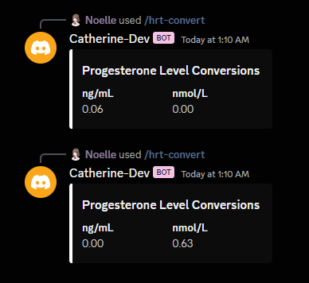

HRT Conversion
==============

.. warning::

    Consult with your doctor about the accuracy of this tool before using it. 
    Ensure that you verified that the outputs are in fact correct before using.

This feature is designed to convert different serum measurements of Estradiol, Progesterone and Testosterone.
Now, the measurements used may be confusing, and here is an breakdown of the different measurements and their name meaning

+---------------------+--------------------------+-------------------------------------------------------------------------------+-----------------------------------------------------------------------------+
| Unit of Measurement |       Name Meaning       |                                     Notes                                     |                               Reference Link                                |
+=====================+==========================+===============================================================================+=============================================================================+
|       pmol/L        |   Picomoles Per Liter    |                                   Used by E                                   |   https://www.nyp.org/healthlibrary/definitions/picomoles-per-liter-pmoll   |
+---------------------+--------------------------+-------------------------------------------------------------------------------+-----------------------------------------------------------------------------+
|        pg/mL        | Picograms Per Milliliter |                                   Used by E                                   | https://www.nyp.org/healthlibrary/definitions/picograms-per-milliliter-pgml |
+---------------------+--------------------------+-------------------------------------------------------------------------------+-----------------------------------------------------------------------------+
|       nmol/L        |   Nanomoles Per Liter    |                               Used by Prog + T                                |   https://www.nyp.org/healthlibrary/definitions/nanomoles-per-liter-nmoll   |
+---------------------+--------------------------+-------------------------------------------------------------------------------+-----------------------------------------------------------------------------+
|        ng/dL        | Nanograms per deciliter  | Used by Prog + T. Internally for Prog, this measurement is converted to ng/mL | https://www.nyp.org/healthlibrary/definitions/nanograms-per-deciliter-ngdl  |
+---------------------+--------------------------+-------------------------------------------------------------------------------+-----------------------------------------------------------------------------+

Now we know what these measurements means, we can start breaking down how to use the commmand.
The command is called ``/hrt-convert`` and has three inputs:

- ``type`` - The given type of HRT to measure for
- ``amount`` - A number form of the amount of suggested unit to convert to
- ``unit`` - The unit to convert to. 

For the input ``unit``, there are two special cases:

1. If the ``type`` is ``Estradiol``, then the only units that will be accepted are ``pmol/L`` and ``pg/mL``
2. For ``Progesterone``, the unit ``ng/dL`` is internally converted to ``ng/mL``.  I'm actually unsure of why, but if you think this is a mistake, please let me know.

And here is an example of how the output looks like. 

